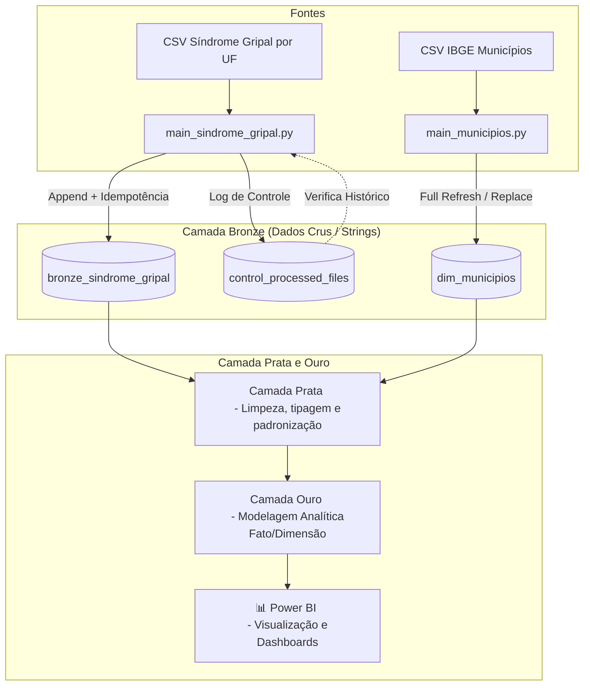

# Pipeline de Engenharia de Dados - OpenDataSUS

Pipeline de engenharia de dados robusto desenvolvido para processar arquivos de Síndrome Gripal e Municípios, automatizando a ingestão para o SQL Server com controle de duplicidade e seguindo boas práticas de arquitetura Medallion.

## Arquitetura do Fluxo de Dados e Camadas (Medallion)

O projeto adota a Arquitetura Medallion para organizar o fluxo e o nível de refino dos dados:



* **Camada Bronze (Ingestão / Raw):** Os dados brutos das origens são persistidos garantindo que todas as colunas sejam convertidas e armazenadas estritamente como **String** (`object`), preservando o formato original e nulos sem perda de informação.
* **Camada Prata (Refinamento):** Etapa intermediária onde os dados serão tratados, tipados corretamente (conversão de datas, números e códigos), limpos e estruturados.
* **Camada Ouro (Analítica / Gold):** Camada de modelagem final orientada a negócios, contendo tabelas Fato e Dimensão prontas para consumo analítico.

## Estratégia de Ingestão e Governança

* **Síndrome Gripal (Carga Incremental & Idempotência):** 
  * Os dados chegam em múltiplos arquivos particionados por UF. 
  * O script realiza uma **varredura na pasta de origem** e consulta uma tabela auxiliar de log no banco de dados chamada `control_processed_files`.
  * Essa tabela armazena os nomes dos arquivos já processados, permitindo que o pipeline ignore arquivos repetidos e execute uma carga **incremental via `append`** apenas dos dados novos, garantindo total idempotência.
* **Municípios (Carga Full Refresh / Substituição):** 
  * O arquivo de municípios do IBGE é tratado como **estático**, dado que a criação ou alteração de limites municipais é extremamente rara no Brasil. 
  * Por essa razão, utiliza-se a estratégia de carga total (`replace`), sobrescrevendo a tabela de referência a cada execução para garantir que o cadastro esteja sempre atualizado com a última versão oficial.

## Stack Tecnológica

* **Linguagem:** Python (Pandas, SQLAlchemy, PyODBC)
* **Banco de Dados:** Microsoft SQL Server (ODBC Driver 17 for SQL Server)
* **Visualização:** Power BI
* **Versionamento:** Git & GitHub

## Como Executar

1. Clone o repositório e ative o ambiente virtual.
2. Instale as dependências necessárias:
   ```bash
   pip install -r requirements.txt
   ```
3. Configure a string de conexão do SQL Server nos scripts.
4. Execute o pipeline de Síndrome Gripal (incremental):
   ```bash
   python src/main_sindrome_gripal.py
   ```
5. Execute o pipeline de Municípios (estático/full):
   ```bash
   python src/main_municipios.py
   ```
